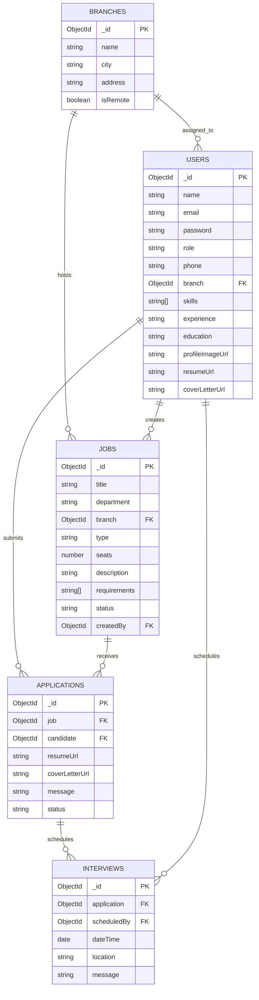

# ER Diagram

## Relationship Notes

- One branch can have many jobs and HR/admin users.
- One candidate can submit many applications.
- Each application belongs to exactly one job and one candidate.
- Each interview belongs to an application and is scheduled by an HR/admin user.
- Cloudinary stores files externally; MongoDB stores only the file URLs.
